# ЛР1. Задание — Работа с сокетами

## Цель работы
Понять принципы межсокетного взаимодейсвтия в вебе. Научиться реализовывать базовую архитектуру клиент-сервер.

## Практическое задание 1. Обмен сообщениями по UDP

UDP — протокол без установления соединения: отправитель просто посылает датаграмму, не дожидаясь подтверждения от получателя. Это быстрее TCP, но не гарантирует ни доставку, ни порядок пакетов. Для простого обмена сообщениями этого достаточно — в Python работа с UDP через socket.SOCK_DGRAM сводится к паре вызовов sendto() и recvfrom() без предварительного подключения.

### Задание
Реализовать клиентскую и серверную часть приложения. Клиент отправляет серверу сообщение «Hello, server», и оно должно отобразиться на стороне сервера. В ответ сервер отправляет клиенту сообщение «Hello, client», которое должно отобразиться у клиента.

Требования:

- Обязательно использовать библиотеку socket.
- Реализовать с помощью протокола UDP.

## Реализация

Для реализации была использована библиотека socket. 

#### Сокет - программный интерфейс для обеспечения информационного обмена между процессами.

Существуют клиентские и серверные сокеты. Серверный сокет прослушивает определенный порт, а клиентский подключается к серверу. 
После того, как было установлено соединение начинается обмен данными.

### Код сервера

??? info "Код"
    ```
    import socket
    
    # создаем сокет
    server_sock = socket.socket(socket.AF_INET, socket.SOCK_DGRAM)
    
    # привязываем сокет к адресу и порту
    server_sock.bind(('localhost', 8080))
    print('Сервер запущен')
    
    # принимаем сообщение от клиента
    data, addr = server_sock.recvfrom(1024)
    print(f"Сообщение от клиента:\n {data.decode('utf-8')}")
    server_sock.sendto(b'Hello, client', addr)
    
    server_sock.close()
    
    ```

### Код клиента

??? info "Код"
    ```
    import socket
    
    client_sock = socket.socket(socket.AF_INET, socket.SOCK_DGRAM)
    
    # отправляем сообщение sendto(bytes, address)
    client_sock.sendto(b'Hello, server', ('localhost', 8080))
    # получаем ответ от сервера
    data, addr = client_sock.recvfrom(1024)
    print(f"Сообщение от сервера\n {data.decode('utf-8')}")
    
    client_sock.close()
    
    ```
### Что происходит?

1. Запускается сервер
2. Сервер создает UDP-сокет
3. Сервер привязывает сокет к localhost:8080
4. Сервер начинает ожидать сообщение
5. Запускается клиент.
6. Клиент создает UDP-сокет
7. Клиент отправляет серверу `Hello, server`
8. Сервер получает сообщение
9. Сервер выводит полученное сообщение.
10. Сервер отправляет клиенту Hello, client.
11. Клиент получает ответ.
12. Клиент выводит ответ.
13. Клиент и сервер закрывают свои сокеты


### Запуск программы

Для выполнения программы необходимо открыть два терминала(для клиента и для сервера)

В первом терминале вводим:

```
    python server.py
```

Во втором терминале:

```
    python client.py
```

### Выполнение

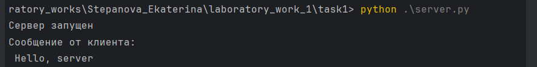

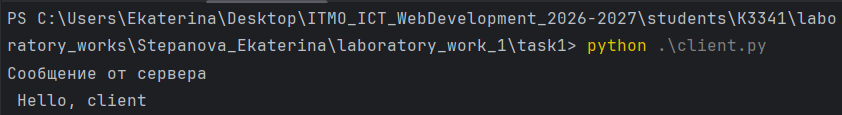


## Практическое задание 2. Вычисления через TCP

TCP, в отличие от UDP, требует установления соединения перед обменом данными и гарантирует доставку и порядок байт. Дополнительные накладные расходы на установку соединения окупаются надёжностью: параметры, введённые пользователем на клиенте, дойдут до сервера, а результат вычисления — обратно. В Python для TCP используется socket.SOCK_STREAM вместе с методами connect() на клиенте и accept() на сервере.

Вариант операции выбирается по порядковому номеру студента в журнале (например, пятый студент получает вариант 1).

Мой порядковый номер в журнале 29 -> тема 4. Теорема Пифагора

### Задание
Реализовать клиентскую и серверную часть приложения. Клиент запрашивает выполнение математической операции, параметры которой вводятся с клавиатуры. Сервер обрабатывает данные и возвращает результат клиенту.

Требования:

- Обязательно использовать библиотеку socket.
- Реализовать с помощью протокола TCP.

## Реализация

Клиент вводит катеты a и b, отправляет их серверу по tcp, сервер вычисляет гипотенузу и возвращает результат.

В Python для создания TCP-сокета используется:

```
    socket.SOCK_STREAM
```

На стороне клиента для подключения к серверу используется метод:

```
    connect()
```

На стороне сервера используются методы:

```
bind()
listen()
accept()
```
### Код сервера

??? info "Код"

    ```
    import socket
    
    server_sock = socket.socket(socket.AF_INET, socket.SOCK_STREAM)  # говорим, что это tcp-сервер
    
    
    def pythagorean_theorem(data):
        a, b = map(float, data.split())
        c = (a ** 2 + b ** 2) ** 0.5
        return c
    
    
    server_sock.bind(('', 8080))  # порт 8080 на всех доступных интерфейсах
    server_sock.listen(1)
    
    while True:
        conn, addr = server_sock.accept()
        print(f"{addr} is connected")
        # считываем данные клиента
        data = conn.recv(1024)
        print(f"Полученные данные от пользователя: {data.decode('utf-8')}")
        if not data:
            break
    
        conn.send(str(pythagorean_theorem(data)).encode('utf-8'))
        print('Сервер останавливается')
        conn.close()
    
    
    ```

### Код клиента

??? info "Код"

    ```
    import socket
    
    client_sock = socket.socket(socket.AF_INET, socket.SOCK_STREAM)
    
    client_sock.connect(('localhost', 8080))
    
    inp = input("Введите величины катов a и b через пробел: ")
    client_sock.send(inp.encode('utf-8'))
    
    data = client_sock.recv(1024)
    print(f"Ответ от сервера: c = {data.decode('utf-8')}")
    
    client_sock.close()
    
    
    ```

### Запуск программы

Для выполнения программы необходимо открыть два терминала(для клиента и для сервера)

В первом терминале вводим:

```
    python server.py
```

Во втором терминале:

```
    python client.py
```

### Выполнение

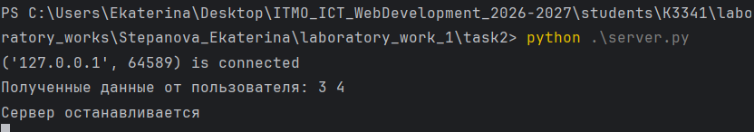

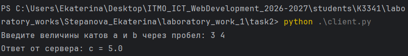


## Практическое задание 3. Раздача HTML-страницы по HTTP

HTTP-ответ — обычный текст, оформленный по строгому формату: строка статуса, заголовки, пустая строка и тело. Серверу достаточно прочитать содержимое index.html, посчитать его длину для заголовка Content-Length и отправить всё одним пакетом через тот же сокет, что принял подключение.

### Задание
Реализовать серверную часть приложения. Клиент подключается к серверу и в ответ получает HTTP-сообщение, содержащее HTML-страницу, которую сервер подгружает из файла index.html.

Требования:

- Обязательно использовать библиотеку socket.
 
## Реализация

При выполнении я решила опираться на код из "Примеры реализации".
В данном задании клиентом является веб-браузер.  В данном задании клиентом выступает веб-браузер. Сервер принимает подключение от браузера и отправляет ему HTML-документ.

### Код HTML-страницы

??? info "Код"
    ```
    <!DOCTYPE html>
    <html>
    <head>
        <title>Itmo labs</title>
    </head>
    <body>
        <h1>Лабораторная работа 1.</h1>
        <h2>Практическое задание 3. Раздача HTML-страницы по HTTP</h2>
        <p>HTTP-ответ — обычный текст, оформленный по строгому формату: строка статуса, заголовки, пустая строка и тело. Серверу достаточно прочитать содержимое index.html, посчитать его длину для заголовка Content-Length и отправить всё одним пакетом через тот же сокет, что принял подключение.</p>
        <p>Реализовать серверную часть приложения. Клиент подключается к серверу и в ответ получает HTTP-сообщение, содержащее HTML-страницу, которую сервер подгружает из файла index.html.</p>
    </body>
    </html>
    ```
### Код сервера

??? info "Код"

    ```
    import socket
    
    # Параметры сервера
    HOST = 'localhost'  # Адрес хоста (localhost для локальных соединений)
    PORT = 9090         # Порт, на котором будет работать сервер
    
    # Создаем сокет
    server_socket = socket.socket(socket.AF_INET, socket.SOCK_STREAM)
    
    # Привязываем сокет к адресу и порту
    server_socket.bind((HOST, PORT))
    
    # Начинаем слушать входящие соединения
    server_socket.listen(5)
    print(f"HTTP сервер запущен на {HOST}:{PORT}...")
    
    while True:
        # Принимаем соединение от клиента
        client_connection, client_address = server_socket.accept()
    
        with open("index.html", "rb") as f: # читаем в бинарном режиме
            html_bytes = f.read()
    
    
        # Формируем HTTP-ответ с заголовками и HTML-контентом
        http_response = (
            "HTTP/1.1 200 OK\r\n"
            "Content-Type: text/html; charset=UTF-8\r\n"
            f"Content-Length: {len(html_bytes)}\r\n"
            "Connection: close\r\n"
            "\r\n"
        )
    
        # Отправляем HTTP-ответ клиенту
        client_connection.sendall(http_response.encode('utf-8') + html_bytes)
    
        # Закрываем соединение
        client_connection.close()
    ```

### Структура HTTP-ответа

    ```
    HTTP/1.1 200 OK
    Content-Type: text/html; charset=UTF-8
    Content-Length: ...
    Connection: close
    
    HTML-содержимое страницы
    ```

- Первая строка содержит статус ответа. 200 OK означает, что запрос был успешно обработан.

- Заголовок Content-Type сообщает браузеру, что сервер отправляет HTML-документ в кодировке UTF-8.

- Content-Length содержит размер HTML-документа в байтах.
- Connection: close сообщает, что после отправки ответа соединение будет закрыто.
- Пустая строка между заголовками и HTML-кодом обязательна для разделения заголовков и тела HTTP-ответа.


### Запуск программы

Для выполнения программы необходимо открыть два терминал для сервера.
В терминале вводим:

```
    python server.py
```

После запуска сервера в терминале появится сообщение:

`HTTP сервер запущен на localhost:9090...`

После этого необходимо открыть браузер и перейти по адресу:

`http://localhost:9090`

### Выполнение

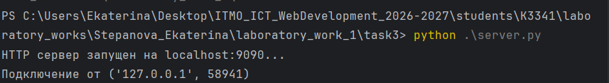

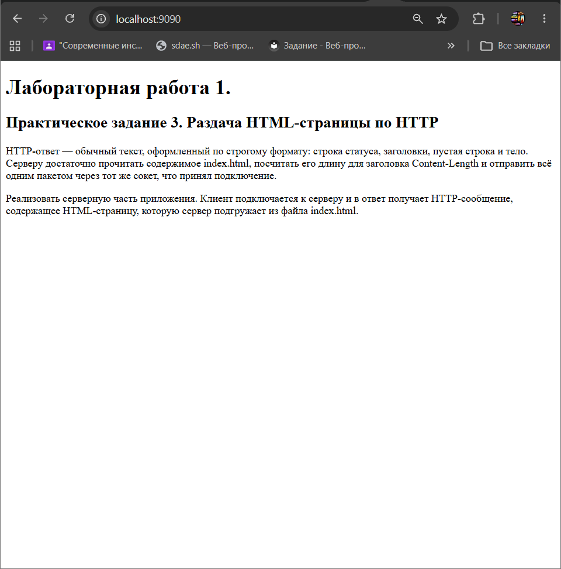

# Практическое задание 4. Чат на сокетах

Чат отличается от предыдущих заданий тем, что сервер обслуживает не одного клиента, а нескольких одновременно. Для TCP это значит — держать список активных подключений и рассылать входящие сообщения всем, кроме отправителя, а для каждого соединения удобно завести отдельный поток. UDP не требует держать соединение открытым, но для параллельного приёма и отправки на клиенте всё равно нужен threading.

### Задание

Реализовать двухпользовательский или многопользовательский чат. Для максимального количества баллов реализуйте многопользовательский чат.

Требования:

- Обязательно использовать библиотеку socket.
- Для многопользовательского чата необходимо использовать библиотеку threading.
- Должна быть возможность идентифицировать пользователей.
- Пользователь должен иметь возможность выйти из чата.

- Реализация:

- Протокол TCP — 100% баллов.
- Протокол UDP — 80% баллов.
Для UDP используйте threading для получения сообщений на клиенте.
Для TCP запустите обработку подключений и сообщений от всех пользователей в потоках. Не забудьте сохранять пользователей, чтобы отправлять им сообщения.

### Реализация

Я реализовала два варианта и tcp и udp. Подробнее рассматривать будем вариант c tcp, так как сама логикка работы чата одинакова.

Сервер хранит подключенных пользователей в словаре, где каждому соединению соответствует имя пользователя. Для каждого клиента создается отдельный поток, благодаря чему несколько пользователей могут одновременно отправлять и получать сообщения.

### Код tcp-сервера

??? info "Код"

    ```
    import socket
    import threading
    
    tcp_server_sock = socket.socket(socket.AF_INET, socket.SOCK_STREAM)
    # привяжем сокет к адресу и порту
    tcp_server_sock.bind(("localhost", 8080))
    tcp_server_sock.listen()
    print("Сервер запущен.....")
    
    # словарь, где сервер будет хранить пользователей: соединение -> имя
    users = {}
    
    
    def broadcast(message, conn):
        for user_conn in list(users.keys()):
            if user_conn != conn:
                user_conn.send(message.encode())
    
    
    def handle_client(conn):
        # первое сообщение от клиента - его имя
        users[conn] = conn.recv(1024).decode()
        message = f"Пользователь {users[conn]} присоединился к чату"
        broadcast(message, conn)
        print(message)
    
        while True:
            data = conn.recv(1024)
            # пустые данные значит клиент закрыл соединение, '/exit' значит вышел сам
            if not data or data.decode() == '/exit':
                message = f'Пользователь {users[conn]} покинул чат'
                broadcast(message, conn)
                print(message)
                del users[conn]
                conn.close()
                break
            message = f"({users[conn]}): {data.decode()}"
            broadcast(message, conn)
            print(message)
    
    
    while True:
        # ожидание новых подключений
        conn, addr = tcp_server_sock.accept()
        # для каждого клиента отдельный поток
        thread = threading.Thread(target=handle_client, args=(conn,), daemon=True)
        thread.start()
    ```

### Код tcp-клиента

??? info "Код"

    ```
    import socket
    import threading
    
    SERVER_ADDR = ("localhost", 8080)
    
    tcp_client_sock = socket.socket(socket.AF_INET, socket.SOCK_STREAM)
    tcp_client_sock.connect(SERVER_ADDR)
    
    # узнать имя пользователя
    username = input("Введите свое имя: ")
    tcp_client_sock.send(username.encode())
    
    
    def receive_message():
        while True:
            data = tcp_client_sock.recv(1024)
            if not data:
                break
            print(data.decode())
    
    
    thread = threading.Thread(target=receive_message, daemon=True)
    thread.start()
    
    # daemon=True Этот поток является вспомогательным. Когда основная программа закончится, его тоже можно завершить
    
    while True:
        message = input()
        if message.strip() == '/exit':
            tcp_client_sock.send('/exit'.encode())
            print("Вы вышли из чата!")
            tcp_client_sock.close()
            break
        else:
            tcp_client_sock.send(message.encode())
    
    ```

### Что происходит?

1. Запускается сервер и начинает ожидать подключения.
2. Клиент подключается к серверу и вводит свое имя.
3. Сервер сохраняет имя и соединение пользователя.
4. Для каждого клиента создается отдельный поток.
5. Клиенты могут одновременно отправлять сообщения.
6. Сервер пересылает сообщение всем пользователям, кроме отправителя.
7. При вводе /exit пользователь выходит из чата.
8. Сервер удаляет пользователя из списка подключенных.

### Запуск программы

Обязательно! Сначала запускаем сервер:

```
python server.py
```

Затем необходимо открыть несколько терминалов и в каждом запустить один и тот же клиент:

```
python client.py

```

После запуска каждый пользователь вводит свое имя и может обмениваться сообщениями с другими участниками.

### Выполнение

Давайте запустим сервер и создадим трех пользователей(Алеша Попович, Добрыня Никитич, Тугарин Змей)

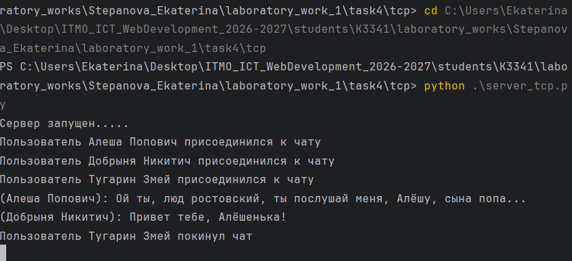
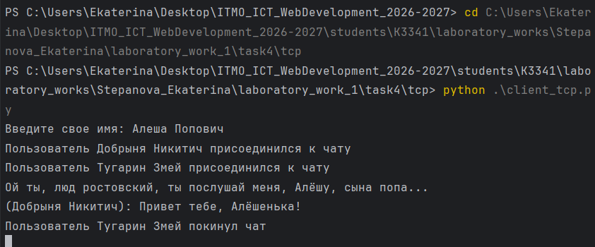
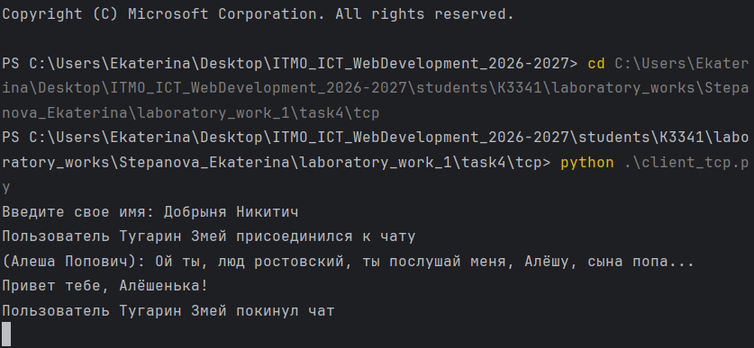
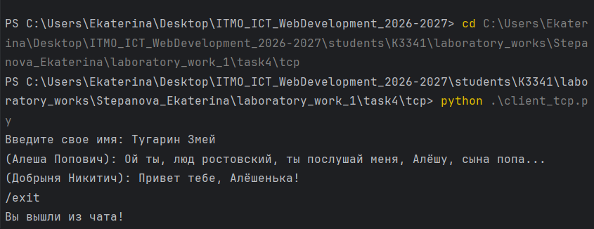

## Практическое задание 5. Простой веб-сервер (GET/POST)

В данном задании необходимо реализовать простой HTTP-сервер, который принимает GET и POST-запросы. Сервер хранит оценки, группируя их по дисциплинам, и отображает журнал в виде HTML-страницы.

### Задание

Реализовать веб-сервер с использованием библиотеки `socket`, который:

- принимает информацию о дисциплине и оценке;
- сохраняет оценки в памяти;
- группирует оценки по названию дисциплины;
- отображает все оценки в виде HTML-страницы;
- обрабатывает HTTP-запросы `GET` и `POST`.

## Реализация

Для хранения оценок используется словарь `grades`, где ключом является название дисциплины, а значением — список оценок.

Например:

```
{
    "Математика": [4, 5, 5],
    "Программирование": [5, 4]
}

```

Сервер самостоятельно разбирает HTTP-запрос: определяет метод, путь, заголовки и тело запроса.

### Код сервера

??? info "Код"
    ```
    # базовый класс для написания http-сервера
    import socket
    from urllib.parse import parse_qs, urlparse
    import sys
    
    
    class MyHTTPServer:
        # Параметры сервера
        def __init__(self, host, port, name):
            self.host = host
            self.port = port
            self.name = name
            self.grades = {}
    
        def serve_forever(self):
            # 1. Запуск сервера на сокете, обработка входящих соединений
            sock = socket.socket(socket.AF_INET, socket.SOCK_STREAM)
            sock.bind((self.host, self.port))
            sock.listen()
            print(f"Сервер запущен на хост: {self.host} порт: {self.port} ")
            while True:
                conn, addr = sock.accept()
                self.serve_client(conn)
                conn.close()
    
        def serve_client(self, conn):
    
            # 2. Обработка клиентского подключения
            file = conn.makefile("r", encoding="utf-8")
            request = file.readline().strip()
            if not request:
                return
            print(request)
            method, path, params = self.parse_request(request)
            headers = self.parse_headers(file)
            print(method, path, '-------------------')
            body = ""
            if "content-length" in headers:
                body = file.read(int(headers["content-length"]))
            status, html = self.handle_request(method, body)
            self.send_response(conn, status, html)
    
        def parse_request(self, request_line):
            method, url, version = request_line.split()
            parsed = urlparse(url)
            path = parsed.path
            params = parse_qs(parsed.query)
            return method, path, params
    
            # 3. функция для обработки заголовка http+запроса. Python, сокет предоставляет возможность создать вокруг него некоторую обертку, которая предоставляет file object интерфейс. Это дайте возможность построчно обработать запрос. Заголовок всегда - первая строка. Первую строку нужно разбить на 3 элемента  (метод + url + версия протокола). URL необходимо разбить на адрес и параметры (isu.ifmo.ru/pls/apex/f?p=2143 , где isu.ifmo.ru/pls/apex/f, а p=2143 - параметр p со значением 2143)
    
        def parse_headers(self, file):
            headers = {}
            while True:
                line = file.readline().strip()
                if not line:
                    break
                key, value = line.split(":", 1)
                headers[key.strip().lower()] = value.strip()
            return headers
    
        # 4. Функция для обработки headers. Необходимо прочитать все заголовки после первой строки до появления пустой строки и сохранить их в массив.
    
        def handle_request(self, method, body):
            if method == "POST":
                data = parse_qs(body)
                subject = data.get("subject", [""])[0].strip()
                grade = data.get("grade", [""])[0].strip()
                if subject and grade.isdigit():
                    self.grades.setdefault(subject, []).append(int(grade))
                    print(self.grades)
            return 200, self.render_page()
    
        # 5. Функция для обработки url в соответствии с нужным методом. В случае данной работы, нужно будет создать набор условий, который обрабатывает GET или POST запрос. GET запрос должен возвращать данные. POST запрос должен записывать данные на основе переданных параметров.
    
        def send_response(self, conn, status, body):
            body_bytes = body.encode('utf-8')
            head = (f"HTTP/1.1 {status} OK\r\n"
                    "Content-Type: text/html; charset=UTF-8\r\n"
                    f"Content-Length: {len(body_bytes)}\r\n"
                    "Connection: close\r\n"
                    "\r\n")
            conn.sendall(head.encode("utf-8") + body_bytes)
    
        def render_page(self):
            grades_html = ""
            for subject, marks in self.grades.items():
                grades_html += f"<p>{subject}: {', '.join(str(m) for m in marks)}</p>"
            return """<h1>Журнал оценок</h1>
                   <form method="post" action="/">
                       <input type="text" name="subject" placeholder="Дисциплина">
                       <input type="text" name="grade" placeholder="Оценка">
                       <button type="submit">Сохранить</button>
                   </form>
                   """ + grades_html
    
    
    # 6. Функция для отправки ответа. Необходимо записать в соединение status line вида HTTP/1.1 <status_code> <reason>. Затем, построчно записать заголовки и пустую строку, обозначающую конец секции заголовков.
    
    if __name__ == '__main__':
        host = "localhost"
        port = 8080
        name = "-Gradebook-"
        serv = MyHTTPServer(host, port, name)
        try:
            serv.serve_forever()
        except KeyboardInterrupt:
            pass
    ```

### Что происходит?

1. Запускается HTTP-сервер на localhost:8080.
2. Сервер ожидает подключения от браузера.
3. Сервер получает HTTP-запрос и определяет его метод.
4. При POST сервер получает название дисциплины и оценку.
5. Оценка добавляется в список соответствующего предмета.
6. При GET сервер формирует HTML-страницу с журналом.
7. Сервер отправляет браузеру HTTP-ответ.
8. Браузер отображает форму и список сохраненных оценок.

### Запуск программы
В терминале вводим:
``` python server.py ```

После запуска открываем в браузере:

```http://localhost:8080```

### Выполнение

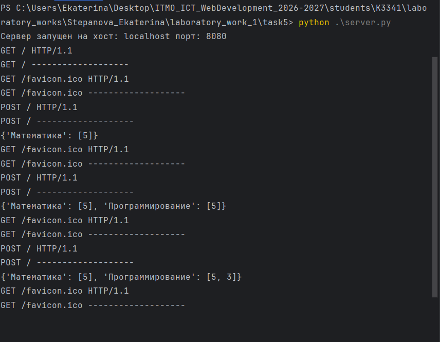
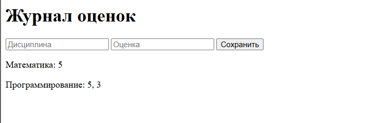